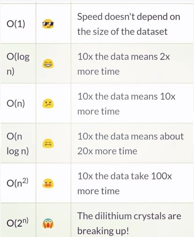

# 401CodeNotes

## Class 1 Notes
  * Writing test driven development
    * Red: broken
    * Green: Pass
    * yellow: still in process
  * Using Jest
    * Package that makes it very simple to test JavaScript code
    * Installed globally
    * npm init inside of testing
      * npm install jest
  * Coverage
    * the full coverage that is/needs to be tested
    * if there is a line of code that isn't tested it will deduct

## Class 2 Notes
    * Functional Programming
      * Pure: A function given the same input should return same output
      * No Shared State: One function doesn't effect how another one runs
      * Immutable: Don't modify the arguments or return value outside of function
    * Why? We want our functions to be efficient and predictable
    * How? Break our functions up or use **higher order functions**
      * Leans us to making smaller and smaller functions that lets us do other things
    * Old: 4 lines of code 1 line of comment
    * Bold: 1 line of code 4 lines of comment
  ### Higher order functions
    * .map, .filter, .reduce, .forEach
    * Essentially calling some other function to do the work instead
    ```function (apiCallURL, callBack) { callBack()} ```

  ### Demo Notes
    * Causes no side effects
      * console.log
      * parameter changes after the fact
      * "state" of the application
      * messing up the async calls / callbacks
    * Spread Operator
      * ``` ...<name> ```
      * this copies something that is completely different from the other array
  ### Objects
    * Boxes for data/information
    * some boxes are generic take all kinds of data
    * Some are weird shapes
    * Some are meant for specific content
    * Some have a security guard out front
  #### JavaScript Variable Types
    * Doesn't do a lot to limit the data in your variables
    * other languages have custom boxes for different data types
    * Functions are also objects!
    * JavaScript allows for "generic object" {}
  #### Making our own Boxes
    * I'm making an application for my pets
    * I want to make a custom "box" that can hold the information for my yellow cat, Kitto:
      * Name
      * Age
      * Fur Color
      * Favorite Treat
        * Her Jump Height
  #### Classes
    * We make our own "box types" by defining a class
      * A specific classification upon data
      * A blueprint for how what the data should look like
    * We then create instances of that class
      * The actual created box with contents
    * Can "extend" a class constructor
    * What is in a class?
      * How to construct an object of this classification
        * what box is this based on?
        * how to build the box
          *What materials (variables) the box needs to initialize

## Class 3 Notes

### Mongoose
  * npm install mongoose for lab 3
  * "const mongoose = require('mongoose');"


## Class 04 Notes

### MiddleWare

  * There is hardware, software and middleware
    * Ware = tool
  * Middleware lets two applications communicate
  * Mongoose helps our application communicate with MongoDB
  * Any tool / function / process between two larger tools / functions / processes
### Middleware within middleware

  * Mongoose itself can have middleware that runs between processes
  * Two distinct types:
    * Pre Middleware: runs before a database command completes
    * post middleware: runs after database command complete
  * We create pre / post middleware using pre / post hooks

### steps for setting up file

  1. npm init 
  2. npm i (mongoose)

### Lab notes
  * If (this.note) does not work try putting it inside of a function

### Creating a Wrapper Interface
  * Knowing the intricacies of Mongoose shouldn't be required to do CRUD actions
  * What if we wrapped the Mongoose code in an easier-to-use class?
    * Standardize operations
    * One Place where we can change what those operations do
  * If we ever change from MongoDB to Postgres, it will be super easy!
    * Interface will stay the same
### Our Model Class
  * We'll have the mongoose model still as-is
  * then we'll wrap the mongoose model in our own model class
  * Can feel redundant and not always necessary
    * More useful for larger application/teams
### Testing a Database
  * We don't want to change any (actual) data
  * When we run our tests, we want to tell the tests to run a "fake" or "mock" database
    * Starts off empty
    * Our test files insert some dummy data at the start
  * New dependency: npm install @code-fellows/supergoose
### Mock??
  * A fake version of the real thing
  * Inputs are the same, and outputs are somewhat the same
  * Our mock databse has the same ability to do CRUD operations, but it's not actually persisting anything
  * You can make a mock of functions too
    * Useful for testing code that uses external modules/functions that you don't need to test

# Lab 5 Notes

## Big O Worst Case Scenario

  * Big O notation tells us the worst case scenario
    * "O"= order/growth rate of a function
    * what is the longest something will run
    * what is the most space something will take up
  * We want to minimize our Big O
    * That's how we know what is efficient
## Big-O is based on input size
  * If you had to iterate through an array, how "long" would it take?
    * Array of size 5 >> 5 commands
    * array of size 100 >> 100 commands
    * array of size n >> n commands
  * The size of the input determines the worst case time and space
  * O(**n**) >> if there are **n** items, it will take **n** time or **n** space
  

## Linked Lists
  * Arrays are very rigid in other languages
  * Linked Lists are more old-school and flexible
    * A collection of independent Nodes
    * Directions of how to get to the next Node
    * No "hopping around" like in arrays
  * Nodes: a piece of data in our data structure
    * object of the important data that fits into the structure well
  * Singularly Linked List
    * Every Node has two properties
      * value
      * Next Node
    * Every Singularly Linked List keeps track of only the start of the list, called the **head**
    * No way to go backwards from a Node, always moving until **next = null**
  * Double Linked List
    * Every Node has three properties
      * value
      * **next** Node
      * **prev** Node
    * Every Double Linked List 
  * Circular Linked List
## Big O and Linked Lists
  * How long does it take to search for something?
    * What you're looking for could be the last list item (in the worst case)
    * You'd have to visit each Node
    * If there are **n** Nodes then .... **O(n)**
  * Changing the List?
    * to insert something in a Linked List, you either
      * insert at the Beginning
        * since you know the head, this is an instant command
        * no looping or traversal, so **O(n)**
# class 5 review
  * class properties are defined in a constructor
  * linked list properties usually are array's
  * function usually prints the values nicely
  * use extends to inherit everything from a different class
  * the head of a linked list is the last 
# Class 6

## HTTP 

### HTTP to CRUD

  * CRUD specifies our standard desired operations on data (create, read, update, delete)
  * HTTP has specific terms for these operations
    * CREATE == POST /pet/{petId}/uploadImage
    * READ == GET /pet/{petId} Find pet by ID
    * UPDATE == PUT /pet
    * DELETE == DELETE /pet/{petId} deletes a pet
  * Request
    * A request usually has the following:
      * Method - GET, POST, PUT or DELETE
      * URL - Where the request should go
      * Headers - administrative information about the client
      * Body (optional) - any data the client needs to send
  * Response
    * A response usually has the following:
      * Body/JSON - any returned data the client asked for
      * Status - a standardized numerical code that tells the client how the request completed(success or error!)
        * 100: hold on
        * 200: here you go
        * 400: Client messed up
        * 500: Server messed up
  * Endpoints
    * Clients request to a URL
    * When you load a website, that's a GET request (GET https://)
    * Servers can have lots of endpoints
  * REST
    * Representational State Transfer: describes proper API endpoint structure and documentation
    * It's a guideline, not a protocol
    * Swagger - swagger.io
      * swagger inspector, inspector.swagger.io/builder
        * place in the web address
        * use the end points, after you hit enter, select the checkbox
          * hit api information
            * swagger hub
              * import the beginning
                * then the documentation is available
                  * view documentation takes you to page for URL
      * A useful tool that makes it easy to create API documentation
      * 

  


